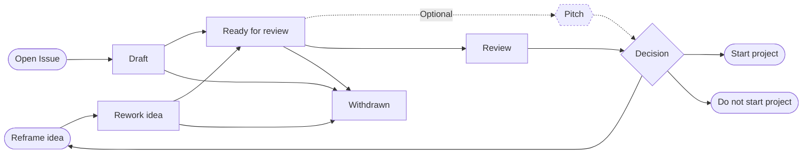

# PSE Ideas
## Rationale
This repository and the corresponding process intend to support collecting ideas and track their status
until potential decision for implementation.

## Process
_Inspired by the [EIP process](https://eips.ethereum.org/EIPS/eip-1) (lighter,less formal/technical process.)_. 

- draft: idea tracked as an issue in this idea repository.
- ready: once the idea's author marks an idea as ready, the PSE team will review it.
- pitch: a monthly pitch day will take place and can be the opportunity for authors to present their ideas.
- decision:
  - rework: idea needs to be refined or scope needs to be adjusted.
  - start project: the PSE group will support the implementation of the idea.
  - do not start project.
