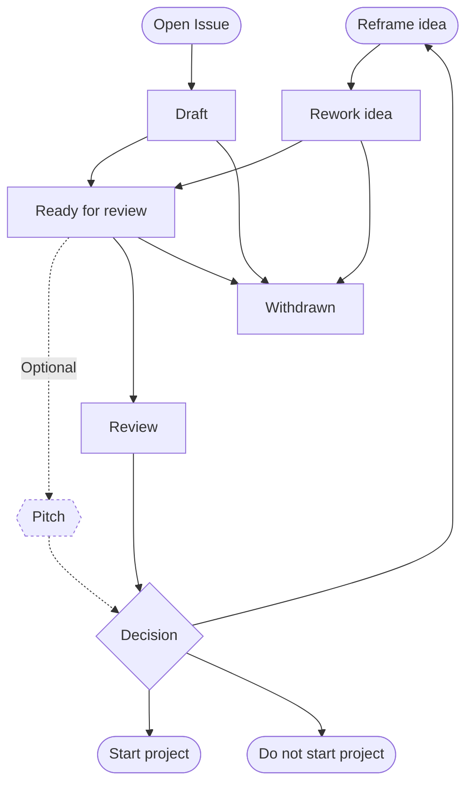

# PSE Ideas
## Rationale
This repository and the corresponding process intends to support collecting ideas and track their status till potential
decision for implementation.

## Process
_Inspired by the [EIP process](https://eips.ethereum.org/EIPS/eip-1) (lighter,less formal/technical process.)_. 

- draft: idea tracked as an issue in this idea repository
- ready: once the idea author marks an idea as ready, the PSE team will review
- pitch: monthly pitch dasy will take place and can be optionally the opporunity for authors to present their ideas
- decision:
  - rework: idea needs to be refined or rescoped
  - start project: the PSE group will support the implementation of the idea
  - do not start project 
